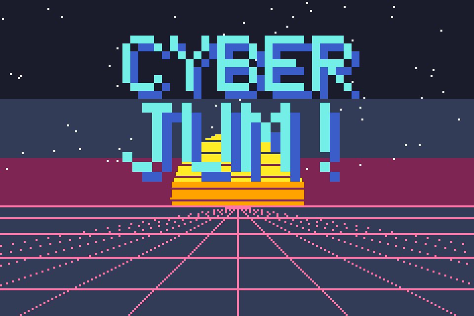

# Cyber Jum

A demo Game Boy Advance game written in readable Rust with the
[agb](https://agbrs.dev) engine.

Walk up a forest road, Pokémon-style — but five characters block the way,
and each one challenges you to their own **CYBER JUMP**: a Mario-style
platformer level where you hop pits, stomp glitch bugs, and race to the
checkered flag on three lives. Lose them all and you're thrown back to the
start of the road. Beat all five challengers to win.

Features: title screen with settings (music/SFX volume), saving to cartridge
SRAM, typewriter dialogue, chiptune music and sound effects, and platformer
quality-of-life touches (coyote time, jump buffering, variable jump height).



## Documentation

| File | What it covers |
|---|---|
| [CODE_TOUR.md](CODE_TOUR.md) | What each source file does and how the engine fits together |
| [BUILDING.md](BUILDING.md) | Compiling the game into a real `.gba` ROM from a clean Mac |
| [TESTING.md](TESTING.md) | Playing it in the mGBA emulator + a test checklist |
| [AI_PROVENANCE.md](AI_PROVENANCE.md) | Which AI model generated this project |
| [assets/README.md](assets/README.md) | Every art/audio asset and how to regenerate them |

## Quick start

```sh
# prerequisites: see BUILDING.md (rustup nightly + agb-gbafix + mgba)
cargo build --release
agb-gbafix target/thumbv4t-none-eabi/release/cyber_jum -o cyber_jum.gba
mgba cyber_jum.gba
```
